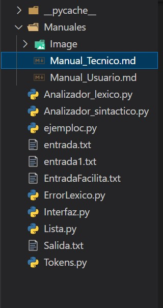
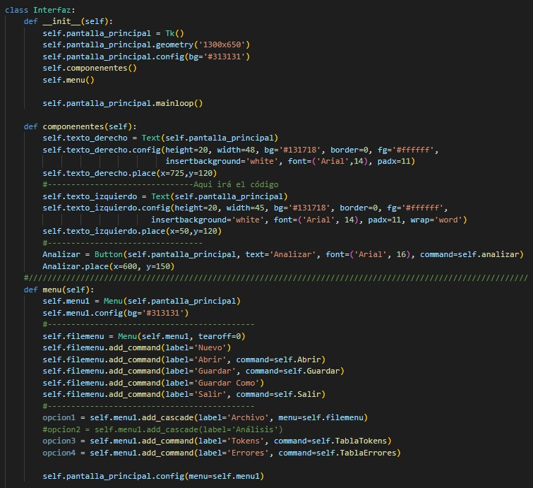
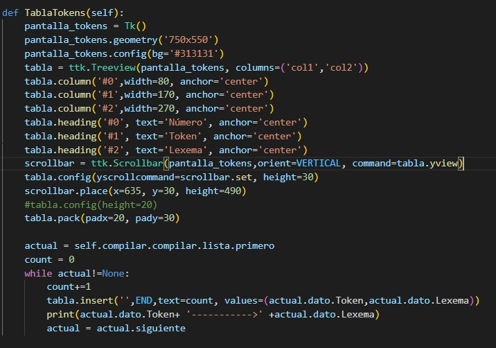
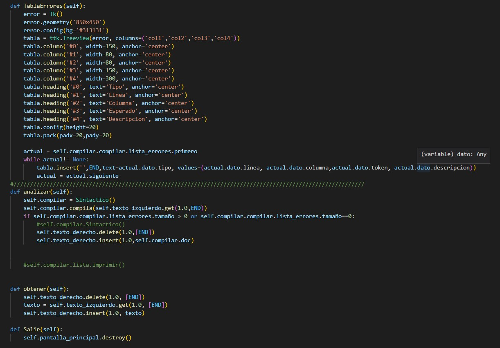
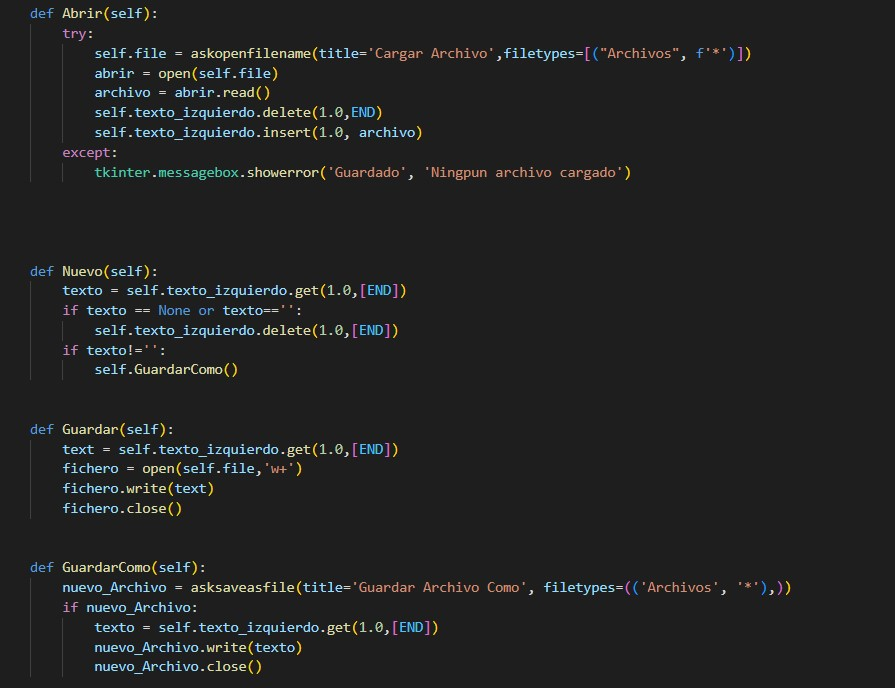

Universidad de San Carlos de Guatemala
Facultad de Ingeniería
Lenguajes Formales y de programacion

 

### 
Manual Técnico 

Nombre: Gerson David Otoniel González Morales

Carné: 202000774

---

Introducción
 
El proyecto consiste en la elaboración de una herramienta gráfica que permita el diseño y creación de sentencias de bases de datos no relacionales de una forma sencilla. La aplicación tiene un área de edición de código y un área de visualización de la sentencia final generada. Al tener ya las sentencias creadas inicialmente, se procederá a realizar la compilación respectiva lo que generará las sentencias de MongoDB que serán mostradas en el espacion de resultados que posteriormente se podrán aplicar a un entorno adecuado a MongoDB.

---

####
Lógica del Sistema
La aplicación esta creada en base al lenguaje de programación Python, a continuación se mostrará el listado de archivos python creados.

El archivo Analizador_lexico.py: se encarga de leer carácter por carácter de la entrada o del archivo de entrada.
El archivo Analizador_sintactico.py: se encarga de que cada sentencia tenga la estructura correspondiente.
El archivo Interfaz.py: se encarga de mostrar la parte vizual del programa con la que el usuario va a interactuar.
El archivo Lista.py: contiene una estructura de datos llamada lista simplemente enlazada.
El archivo Tokens.py: se encarga de crear un nodo para las especificaciones de cada Token tales como su token, lexema, fila y columna.
El archivo Error.py: se encarga de mostrar el tipo de error, la fila y la columna donde ocurrió junto con su descripcion apropiada.

###### \* Descripcion de los archivos

Para el Archivo Imterfaz.py, esta parte de código crea la ventana principla en donde el método constructor crea la ventana, el método componentes crea las dos áreas donde se mostrara código y el botón de analizar. El método menu crea el menú que se muestra en la parte de arriba y contiene todas la opciones tales como: Nuevo, Abrir, Guardar, Guardar Como y Salir.

Este método TablaTokens crea la tabla y recorre la lista para mostras la información de cada token.

Se crea una tabla para los errores y se recorrea la lista de errores para insertarlos en la tabla.
El método analizar obtiene el codigo del área de código para ser compilado.
El método Salir cierra la pantalla principal dado por terminado el programa.

El método Abrir se muestra el buscador de archivos para que un archivo sea compilado.
El método Nuevo revisa si el área de codigo esta vacía, sino lo está entonces pregunta si se desea guardar el archivo que se tiene abierto sino el archivo es limpiado para crear código.
El método GuardarComo se encarga tomar el código escrito en el área de código y así poder guardarlo con un nombre.
