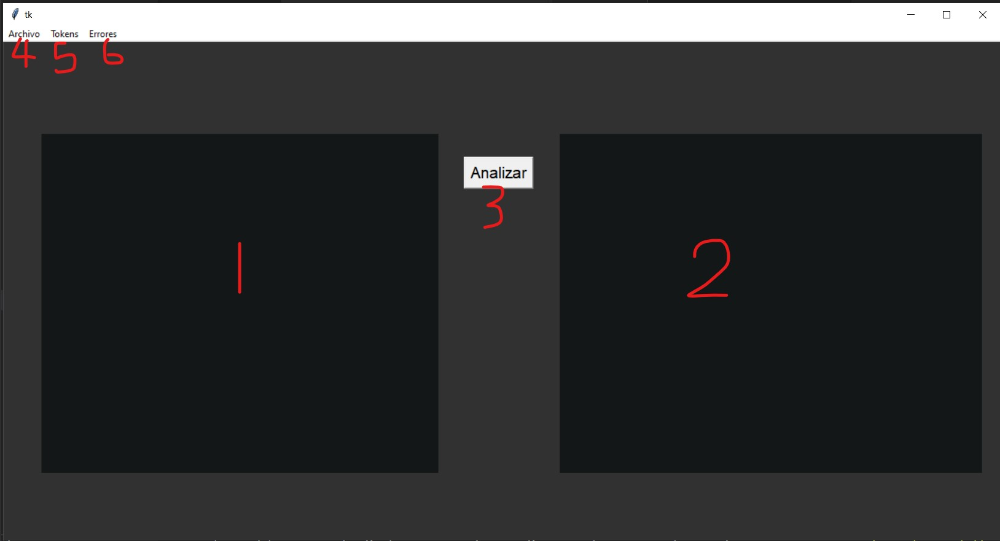
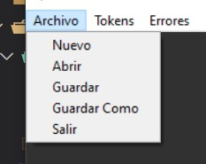
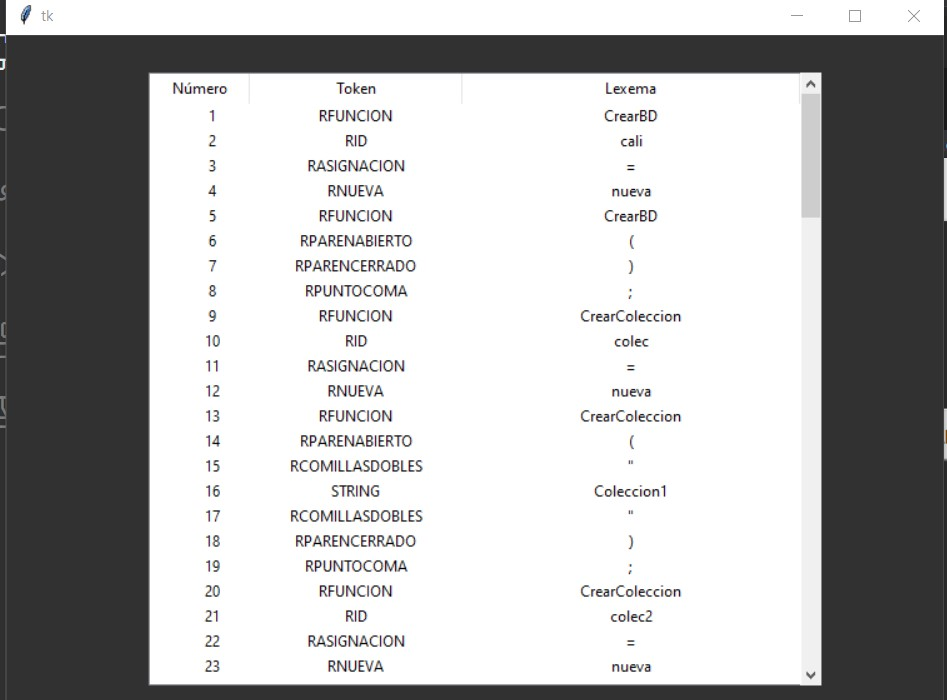
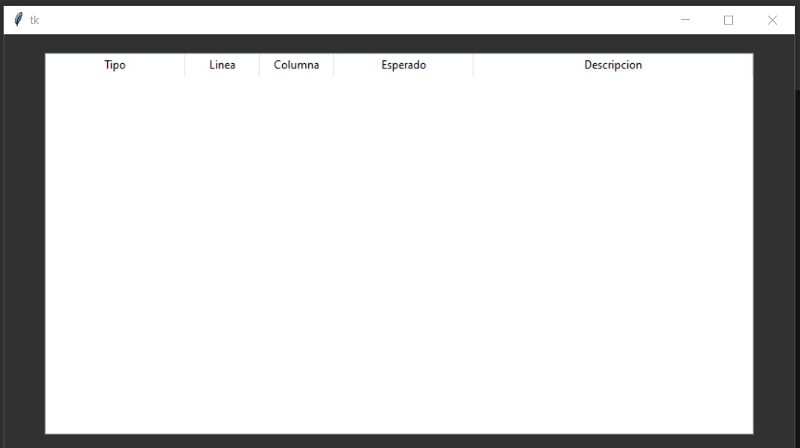

Universidad de San Carlos de Guatemala
Facultad de Ingeniería
Lenguajes Formales y de programacion

 

### 
Manual de usuario 

Nombre: Gerson David Otoniel González Morales

Carné: 202000774

---

####  
Introducción

El propósito del programa es el de traducir un lenguaje de programación a sentencias NoSQL, esto quiere decir que se dará una serie de instrucciones las cuales se analizarán y se traducirán a otro lenguajes en simple síntesis.
Esto se logra apartir de la creación de una interfaz gráfica la cual tiene un espacion para la escritura de código y un área para la visualización de los resultado tras haber analizado el texto.

####  
Requisitos del Sistema

- Windows 10 Pro/Home
- Por lo menos 4GB de memoria RAM
- Arquitectura de x64 bits
- Un editor de texto como Visual Studio Code
- Añadir al editor el interprete de python
- Descargar Python

Para descargar VSCode se puede ir al siguiente link: https://code.visualstudio.com/

Para descargar el interprete de python debe ir a la parte de extensiones de VSCode y buscar "Python Microsoft", luego instala y reinicia el editor.

Para descargar Python puede hacer click en el siguiente link: https://www.python.org/downloads/

---

####
Descripción General del Programa

Al compilar el archivo (**\Lenguajes Formales y de Programación\Laboratorio\LFP_Proyecto2_202000774**),
se desplegará la siguente ventana:
 

EL cuadro con el número 1, es la parte en donde se mostrarán los archivos que se carguen, también se puede escribir sin haber abierto un archivo con anterioridad y posteriormente se puede guardar lo que se haya escrito en un archivo.

El botón con el número 3 analizará el archivo que se cargo o el código que se haya escrito en el cuadro 1 para mostrar las sentencias finales.

El cuadro con el número 2, es la parte donde se mostrarán las senctencias en lenguaje NoSQL, para que posteriormente sean guardadas en un archivo de texto.

Ahora veremos el número 4:
 

En la imagen se presentan 5 opciones, la priemera opcion limpia el área de código, si existiera un archivo abierto se preguntará si se desea guardar los cambios antes de limpiar el área.
La segunda opción permite abrir un archivo ya creado previamente que contiene las senctencias que generaran los comandos a MongoDB.
La tercera opción permite guardar el código que se está escribiendo actualmente.
La cuarta opción permite guardar el código de las sentencias que se estan editando con otro nombre.
Y la quinta opción permite cerrar la aplicación.

Ahora veremos el número 5:
 

Esta opción mostrará una tabla en la cual estarán listados todos los tokens que se reconocieron en el archivo de entrada.
Se muestra el número de Token, el Token y el lexema.

Ahora veremos el número 6:
 

En esta parte esta conformada por una tabla y dentro de esta serán cargados tanto los errores léxicos como los errores sintácticos luego de compilado algún archivo.
En esta área se tendra el tipo de error, línea donde ocurrió, columna, token esperado o componente esperado y descripción.

Una vez analizado el archvo se podra guardar el archivo de salida como un archivo de texto.
